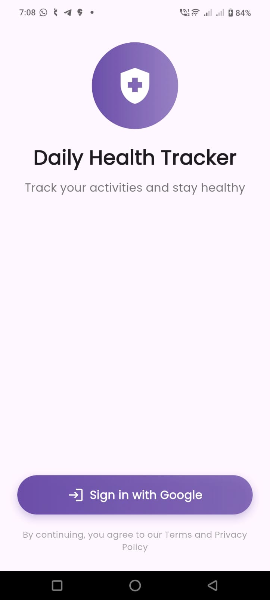
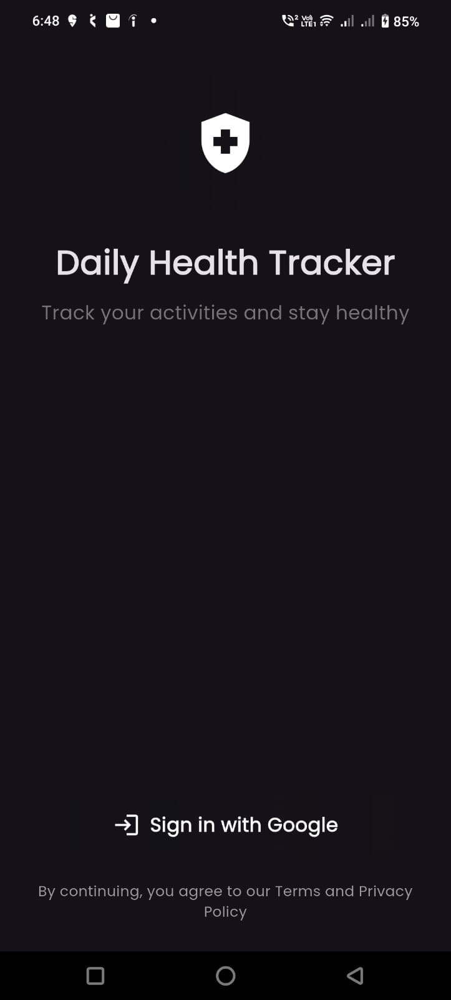
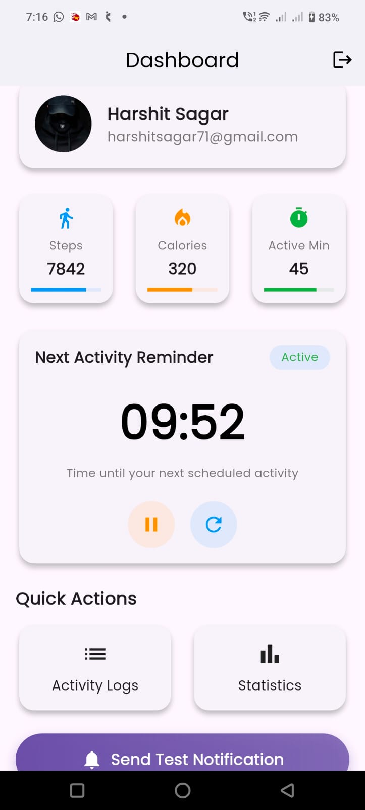
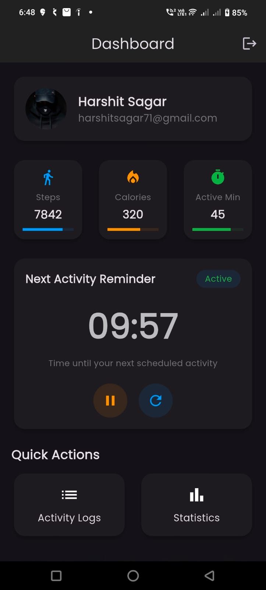
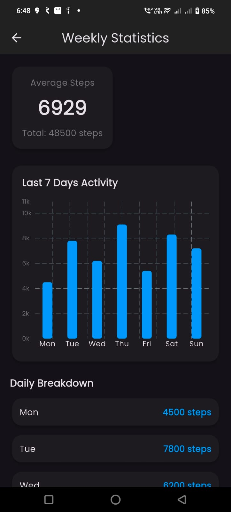

# Daily Health Tracker

A Flutter health tracking app with Google Sign-In, activity logs, graphs, and smart reminders.

## ✅ Features:

| Feature | Description | Status |
|---------|-------------|--------|
| **Google Login** | Firebase Google Sign-In with profile display | ✅ |
| **MVC & GetX** | Clean architecture with GetX controllers | ✅ |
| **REST API** | JSONPlaceholder integration for activity logs | ✅ |
| **Graph Page** | 7-day step chart using fl_chart | ✅ |
| **Lazy Loading** | Infinite scroll pagination | ✅ |
| **Countdown Timer** | 10-min timer with pause/reset | ✅ |
| **Animations** | Fade/scale animations on cards/buttons | ✅ |
| **UI Design** | Modern responsive UI + dark mode | ✅ |
| **Bonus**  | Local notifications + theme switching | ✅ |
| **README**  | Complete setup guide | ✅ |

## Setup Instructions 🚀

1. **Clone repository**
   ```bash
   git clone https://github.com/harshitsagar/yoga-home-assignment.git

2. **Install dependencies**
   ```bash
   flutter pub get
   
3. **Firebase Setup**
    ```bash
    - Add google-services.json to android/app/
    - Run flutterfire configure to generate firebase_options.dart
    - Enable Google Sign-In in Firebase Console   

4. **Run the App**
   ```bash
    flutter run

📁 Structure:
   lib/
   ├── controllers/   # GetX controllers
   ├── views/        # UI screens
   ├── models/       # Data models
   ├── services/     # API & Firebase
   └── main.dart

## 📱 App Screenshots

### Login Screen
| Light Mode                                           | Dark Mode                                           |
|------------------------------------------------------|-----------------------------------------------------|
|  |  |

### Dashboard
| Light Mode | Dark Mode |
|------------|-----------|
|  |  |

### Graph Page
| Light Mode | Dark Mode |
|------------|-----------|
|  |  |

🔧 Tech Stack:
- Flutter + GetX
- Firebase Auth
- fl_chart
- JSONPlaceholder API


